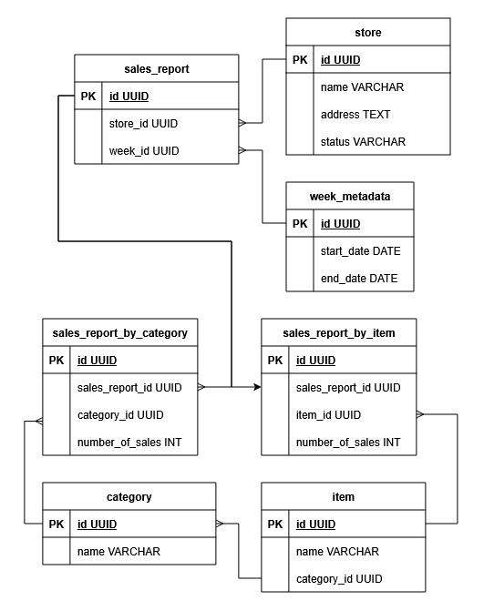

# Restaurant Chain Weekly Sales Analysis System

## Problem Overview

System designed to store and analyze weekly sales data from approximately 50,000 franchise locations of a large restaurant chain, handling flexible reporting formats and providing efficient analytics capabilities.

### Key Requirements
- Process both category-level and item-level sales reports
- Support weekly format changes by individual franchises
- Handle partial menu offerings (subset of ~150 possible items)
- Provide performant analytics at scale

### Scale Parameters
- Franchises: ~50,000
- Menu Items: ~150 potential items
- Reporting Frequency: Weekly
- Data Format: Mixed (category-level or item-level)

## Data Model

### Schema diagram



### Core Tables
1. `store`
   - Represents individual franchise locations
   - Tracks basic store information and status
   - Maintains audit timestamps

2. `category` and `item`
   - Two-level product hierarchy
   - Enforces unique naming
   - Items are linked to exactly one category

3. `sales_report`
   - Weekly report container for each store
   - Links to detailed sales data in either format

4. `sales_report_by_category` and `sales_report_by_item`
   - Stores actual sales numbers
   - Supports both reporting formats
   - Enforces non-negative sales values

5. `week_metadata`
   - Defines valid week periods
   - Ensures data integrity for time periods

## Scenarios and example solutions

Below are common reporting scenarios and how the current model and views can be used or extended to answer them. This emphasizes flexibility: views can be regular, materialized, or indexed depending on usage.

Scenario - Getting sales totals across franchises with mixed reporting formats
- Many franchises submit category-level reports while others submit item-level reports in the same week. The model handles both via `sales_report_by_category` and `sales_report_by_item` tables. Query `sales_by_category_per_week` and `sales_by_item_per_week` for individual aggregate views, or use `total_sales_by_category_per_week` to combine both reporting formats into unified category totals. Optional: use category totals and received item-level data to estimate item-level sales across all franchises.

Scenario - Ranking best-sellers while accounting for availability
- Rankings can be produced from `best_selling_categories_by_week` using `total_sales_by_category_per_week` or `sales_by_item_per_week`. The current view returns the top ten categories per week. To account for availability (e.g., fraction-of-available-stock sold), an optional `store_menu` table could track which items each franchise offers, allowing normalization by per-store availability. Adjustments to ranking logic and limits are straightforward view modifications.

Scenario - Detecting outlier stores or anomalous weeks
- `outlier_stores_by_week` uses statistical analysis (z-score method) to identify stores with unusual sales patterns relative to peers in the same week. High z-scores indicate above-average sales; low scores indicate underperformance. The threshold (currently 2 standard deviations) can be tuned for business sensitivity. This approach can be adapted to detect anomalous weeks for a specific store or to use alternative metrics (percentile-based, cohort comparisons).

Scenario - Comparing current week versus all-time highs
- `weekly_sales_vs_all_time_high_by_category` compares each category's weekly sales against its historical peak, expressing the result as a percentage. This helps identify categories that are underperforming relative to their historical potential. Similar comparisons can be built for stores (comparing store totals to all-time store highs) or for regional trends.

### Sample Analytics

1. Find best-performing categories for a week:
```sql
SELECT * FROM best_selling_categories_by_week
WHERE week_id = 'target_week_id'
ORDER BY rank;
```

2. Identify underperforming stores on a given week:
```sql
SELECT * FROM outlier_stores_by_week
WHERE week_id = 'target_week_id'
AND outlier_type = 'low';
```

3. Compare current sales performance by category to historical peaks:
```sql
SELECT * FROM weekly_sales_vs_all_time_high_by_category
WHERE week_id = 'target_week_id'
ORDER BY percentage_of_all_time_high DESC;
```

## Implementation Considerations

### View Strategy
1. Materialized Views
   - Best for frequently accessed base aggregations
   - Examples:
     - `sales_by_category_per_week`: Foundation for many reports
     - `total_sales_by_category_per_week`: Used in multiple analyses
   - Consider refresh timing based on business needs, for example weekly after receiving the reports of all franchises
   - Add indexes for common filter patterns
   - Can be partitioned per period, to avoid recalculate everything when refreshed, as it is not expected to receive new reports of past weeks

2. Regular Views
   - Suitable for flexible calculations
   - Examples:
     - `outlier_stores_by_week`: Allows threshold adjustments
     - `best_selling_categories_by_week`: Adaptable rankings
   - Can be converted to materialized if performance requires

### Data Processing
- ETL pipeline using Apache Kafka and Airflow
- Parallel processing for multiple franchise reports
- Data validation and transformation layer

## Assumptions

1. Data Structure
   - Items belong to exactly one category
   - Category and item names are standardized
   - Sales numbers are non-negative integers
   - Reports follow consistent weekly boundaries

2. Operational
   - Reports are submitted within their designated week
   - Data corrections follow a defined process
   - Category hierarchies remain relatively stable
   - Store IDs and product IDs are consistent

## System Evolution: scenarios and adaptation

The system is intentionally modular to adapt to changing requirements. Below are concise scenarios that show how it can evolve and what changes would be typical.

Scenario - Large historical retention and archiving
- Need: keep many years of data while maintaining query performance.
- How to adapt: partition large tables by month or year, offload older partitions to cheaper storage, or migrate to a data warehouse optimized for long-term analytics.

Scenario - High concurrency dashboards
- Need: many concurrent users querying the same reports simultaneously.
- How to adapt: materialize frequently-read views, deploy read replicas of the database, and add application-layer caching.

Scenario - Regional or cohort-based analysis
- Need: segment performance by region, franchise size, or other attributes.
- How to adapt: add grouping columns to the store table (region, size_tier), create pre-aggregated views partitioned by these attributes, or add downstream summary tables.

These scenarios demonstrate that the schema and view strategy support incremental adaptation: start with clear base aggregations, monitor usage patterns, and materialize or index the hot paths as requirements become concrete.

## Questions for Subject Matter Experts

To refine this design further and align with business needs, these key questions could be addressed:

### Data & Reporting
1. How frequently are franchise reports submitted, and what is the deadline each week?
2. What validation or consistency rules should apply to submitted sales numbers?
3. How are late or missing reports handled?
4. Can historical data be corrected after submission, and how?

### Business Requirements
5. Which metrics are accessed most frequently and by whom?
6. Are there SLAs for query response times or report freshness?
7. Should rankings account for franchise size, location, or availability (which franchises offer which items)?

### Technical & Operations
8. How often should materialized views be refreshed, and what is the acceptable cost?
9. What data retention and archival strategy is required?
10. Are there preferences for the technology stack (e.g., PostgreSQL, data warehouse, cloud platform)?
